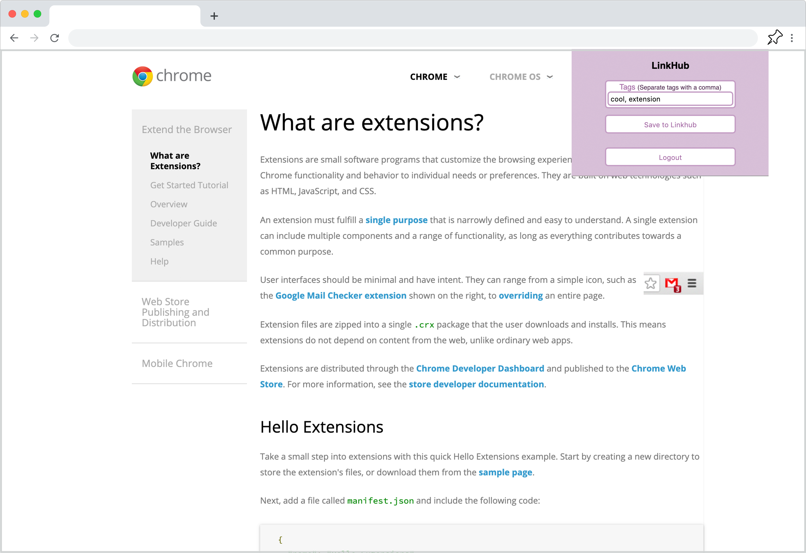

# LinkHub
Companion chrome extension for LinkHub website. Save links from across the internet!

Meet LinkHub! A hub for YOUR links! A website with a companion chrome extension that lets you save links from across the internet and see visually appealing previews! Tag your saved links for easy lookup later! Copy the links to your clipboard so you can share them with friends! Click on the preview image to navigate to the saved link!

Created in four days as part of Grace Hopper Stackathon. Uses React, Redux, Node.js, Express, postgreSQL, chrome API's, and other 3rd party API's

# How to use it
Not in the chrome store, but if you would like to use it you can clone this repo and follow [this tutorial](https://developer.chrome.com/extensions/getstarted) to get it set up on your own browser!

After making an account at <https://link--hub.herokuapp.com/> you'll be able to log in the extension!

Just click on the extension icon, tag your post, and click save!

View your saved links at your own personal [LinkHub](https://link--hub.herokuapp.com/)

